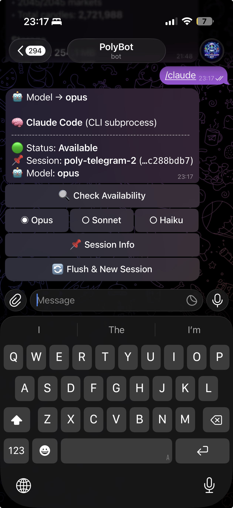

<p align="center">
  &nbsp;&nbsp;&nbsp;&nbsp;&nbsp;
  
</p>

# TeleClaude


**Build self-improving applications with Telegram + Claude Code.**

<p align="center">
  <a href="https://pypi.org/project/teleclaude/"></a>
  <a href="https://pypi.org/project/teleclaude/"></a>
  <a href="LICENSE"></a>
</p>

---

## The idea: conversational self-improvement

TeleClaude enables **agentic self-development** - your deployed application becomes its own development environment. You talk to it through Telegram, it understands its own codebase via [Claude Code](https://github.com/anthropics/claude-code), proposes changes, and - once you approve - rewrites its own source code and restarts itself with the improvements live.

This is a **closed-loop development cycle**: `chat -> analyze -> plan -> approve -> edit -> restart`. No IDE, no SSH, no deploy pipeline. Just a conversation with your running application from your phone.

The technical pattern is sometimes called **reflexive software** or **agentic bootstrapping** - a system that can inspect and modify itself through an AI agent. TeleClaude packages this into a simple Python framework.

**Why?** [Claude Code](https://docs.anthropic.com/en/docs/claude-code) is a powerful agentic coding tool (82K+ stars), but it lives in your terminal. TeleClaude lets you talk to it from anywhere - your phone, a group chat, on the go - while keeping the human-in-the-loop approval flow that makes it safe for real codebases.


## How it works

```
+----------------+        +-----------------+        +--------------------+
|   Telegram     |  msg   |   TeleClaude    | stdin  |    Claude Code     |
|   (phone)      |------->|   (Python bot)  |------->|    (subprocess)    |
|                |<-------|                 |<-------|                    |
|                | reply  |  plan/approve   | stdout |   reads/edits      |
|                |        |  workflow       |        |   your codebase    |
+----------------+        +-----------------+        +--------------------+
```

<table>
<tr>
<td valign="top" style="white-space: nowrap;">

1. You send a message in Telegram
2. TeleClaude routes it to Claude Code in **read-only plan mode**
3. Claude analyzes your codebase and proposes a plan
4. You `/approve` or `/reject` from Telegram
5. On approve, Claude executes with file-edit permissions
6. `/restart` reloads the bot to pick up code changes
7. The application is now running its improved version of itself

</td>
<td align="center" valign="middle">

<a href="assets/example-from-polybot.png"></a>

</td>
</tr>
</table>

## Quickstart

### Prerequisites

- Python >= 3.10
- [Claude Code CLI](https://docs.anthropic.com/en/docs/claude-code) installed and authenticated
- A Telegram bot token from [@BotFather](https://t.me/BotFather)

### Install

```bash
pip install teleclaude
```

### Create your bot

```python
import os, time
from dotenv import load_dotenv
from teleclaude import ClaudeSession, TeleClaudeBot, kill_previous

load_dotenv()

kill_previous("bot.pid")
session = ClaudeSession(project_dir=".")
bot = TeleClaudeBot(
    token=os.environ["TELEGRAM_BOT_TOKEN"],
    chat_id=os.environ["TELEGRAM_CHAT_ID"],
    claude_session=session,
)
bot.start_polling()

try:
    while bot.running:
        time.sleep(1)
except KeyboardInterrupt:
    bot.stop_polling()
```

That's it. Send any message in Telegram and Claude Code responds. Built-in commands:

| Command     | What it does                                                        |
| ----------- | ------------------------------------------------------------------- |
| Free text   | Chat with Claude Code (read-only mode)                              |
| Voice msg   | Transcribed via Whisper, then routed to Claude                      |
| `/claude`   | Interactive menu: model switcher, session info, flush, approve/reject |
| `/approve`  | Execute Claude's pending plan (allows file edits)                   |
| `/reject`   | Discard the pending plan                                            |
| `/session`  | Session management (`/session pin <id>`, `/session clear`)          |
| `/context`  | Check Claude Code availability (rate-limit detection)               |
| `/restart`  | Restart the bot process (picks up code changes)                     |
| `/help`     | Show all available commands                                         |

### Add your own commands

Subclass `TeleClaudeBot` and override `domain_commands()` to register custom `/commands`:

```python
import subprocess
from teleclaude import ClaudeSession, TeleClaudeBot, kill_previous

class MyBot(TeleClaudeBot):
    def domain_commands(self):
        return {
            "/status": (self.cmd_status, "Show git status"),
        }

    def cmd_status(self):
        result = subprocess.run(
            ["git", "log", "--oneline", "-5"],
            capture_output=True, text=True, cwd=self._project_dir,
        )
        self.send(f"<pre>{result.stdout or 'No git history.'}</pre>")
```

Other hooks you can override:

| Hook | Purpose |
| ---- | ------- |
| `on_domain_callback(data, message_id)` | Handle inline keyboard callbacks |
| `help_text()` | Customize `/help` output |
| `on_restart()` | Customize restart behavior |
| `plan_prompt_wrapper(text)` | Customize the prompt sent to Claude in plan mode |

## Features

### Voice messages

Send a voice message in Telegram and it gets auto-transcribed via [OpenAI Whisper](https://github.com/openai/whisper), then routed to Claude. Install the optional dependency:

```bash
pip install openai-whisper
```

The Whisper model (`base`) is lazy-loaded on first voice message. If not installed, the bot replies with install instructions.

### Session handoff

The `/claude` menu includes **Flush & New Session**, which:
1. Asks Claude to write a `.handoff.md` summary of the current session context
2. Clears the session pin
3. On the next message, a new session bootstraps from `.handoff.md` automatically

To enable automatic handoff bootstrap, pass `bootstrap_file` to `ClaudeSession`:

```python
session = ClaudeSession(project_dir=".", bootstrap_file=".handoff.md")
```

### Rate-limit detection

When Claude returns a rate-limit error, the bot automatically starts background polling (every 5 min, up to 12 h) and notifies you when Claude is back online. You can also manually check via `/context` or the `/claude` menu.

## Session modes

### CLI mode (`ClaudeSession`) - recommended

Spawns `claude --print` as a subprocess per message with JSON output parsing. Features:

- **Session persistence**: IDs saved to disk, resumed with `--resume` for multi-turn context
- **Two permission modes**: plan (read-only) and edit (file modifications)
- **Automatic fallback**: expired sessions gracefully restart fresh
- **Model switching**: Opus, Sonnet, Haiku - switchable via `/claude` menu or `set_model()`
- **Usage stats**: tokens, cost, context window % tracked via `SessionStats`
- **Configurable**: custom tools, max turns, output format, named sessions

### Channel mode (`ClaudeChannelSession`) - future

Stub for the upcoming Anthropic SDK channel API. Not yet functional - `run()` raises `NotImplementedError`. Will share the same interface as CLI mode when available.

## Configuration reference

### `ClaudeSession` options

```python
session = ClaudeSession(
    project_dir=".",              # repo root (resolved to absolute path)
    model="opus",                 # "opus", "sonnet", or "haiku"
    output_format="json",         # "json" or "stream-json"
    bootstrap_file=".handoff.md", # auto-inject on new sessions (None to disable)
    auto_pin=True,                # auto-save session ID on first use
    session_name_prefix="mybot",  # generates mybot-1, mybot-2, etc.
    plan_max_turns=25,            # max turns in plan (read-only) mode
    edit_max_turns=25,            # max turns in edit mode
    plan_tools=["Read", "Grep"], # override default plan-mode tools
    edit_tools=["Read", "Edit"], # override default edit-mode tools
    on_session_fallback=callback, # called when pinned session expires
)
```

### `SessionStats`

Cumulative usage stats, accessible via `session.stats`:

| Field | Type | Description |
| ----- | ---- | ----------- |
| `total_turns` | `int` | Number of CLI invocations |
| `total_cost_usd` | `float` | Accumulated API cost |
| `total_duration_ms` | `int` | Total wall-clock time |
| `total_input_tokens` | `int` | Input tokens consumed |
| `total_output_tokens` | `int` | Output tokens generated |
| `total_cache_read_tokens` | `int` | Tokens served from cache |
| `total_cache_creation_tokens` | `int` | Tokens written to cache |
| `context_window` | `int` | Model's context window size |

Context usage percentage: `session.context_pct` (0-100 or `None` if unknown).

## Architecture

```
teleclaude/
  session_cli.py      # Claude Code subprocess wrapper with session persistence
  session_channel.py  # Channel API stub (same interface, future)
  base_bot.py         # Telegram base class: /approve, /reject, /restart + free-text routing
  self_update.py      # PID file management + os.execv restart
```

| Module            | What it does                                                               |
| ----------------- | -------------------------------------------------------------------------- |
| `ClaudeSession`   | Wraps `claude --print` with session pinning, plan/edit modes, JSON parsing |
| `TeleClaudeBot`   | Sync Telegram bot (`requests`-based) with plan/approve/execute workflow. Extensible via hooks |
| `kill_previous()` | PID file management - kills stale bot processes on startup                 |
| `restart()`       | `os.execv` process replacement - reload code without downtime              |

## Local development

```bash
git clone https://github.com/ofir5300/teleclaude.git
cd teleclaude
pip install -e .
cd example
cp .env.example .env  # fill in your tokens
python main.py
```

## Related resources

**Claude Code:**

- [Claude Code - Official GitHub](https://github.com/anthropics/claude-code) (82K+ stars)
- [Claude Code Documentation](https://docs.anthropic.com/en/docs/claude-code)
- [Claude Code Overview](https://code.claude.com/docs/en/overview)

**Guides and tutorials:**

- [Claude Code Tutorial for Beginners 2026](https://dev.to/ayyazzafar/claude-code-tutorial-for-beginners-2026-from-installation-to-building-your-first-project-1lma) - dev.to
- [Claude Code: A Guide With Practical Examples](https://www.datacamp.com/tutorial/claude-code) - DataCamp
- [Claude Code CLI Cheatsheet](https://shipyard.build/blog/claude-code-cheat-sheet/) - Shipyard

**Community:**

- [What makes Claude Code so good](https://news.ycombinator.com/item?id=44998295) - Hacker News discussion
- [awesome-claude-code](https://github.com/hesreallyhim/awesome-claude-code) - Curated plugins, hooks, and commands

## Contributing

Contributions welcome! Open an issue or PR on [GitHub](https://github.com/ofir5300/teleclaude).

## License

[MIT](LICENSE) - Ofir Cohen
