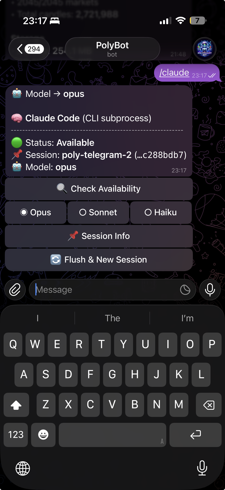

<p align="center">
  &nbsp;&nbsp;&nbsp;&nbsp;&nbsp;
  
</p>

# TeleClaude

**Build Telegram apps that can be developed from Telegram.**

TeleClaude is a Python base app for Telegram-first products that pair naturally with [Claude Code](https://github.com/anthropics/claude-code). You message your running bot, Claude Code reads the repo, proposes a plan, and you approve the change from Telegram. The bot can then restart and pick up the new code.

It is useful when the product interface is Telegram, and you want the development loop to live there too.

<sub>`anthropic` `claude-code` `telegram-bot` `ai-agent` `human-in-the-loop` `whisper` `voice-to-code` `agentic-coding` `python`</sub>

<p align="center">
  <a href="https://pypi.org/project/teleclaude/"></a>
  <a href="https://pypi.org/project/teleclaude/"></a>
  <a href="LICENSE"></a>
</p>

---

## Why this exists

I kept building small Telegram apps and wanted a smoother loop:

1. Ask the running app for a change
2. Let Claude Code inspect the repo
3. Review the plan in Telegram
4. Approve or reject the edit
5. Restart the bot when the change is ready

For many changes, that means no SSH session and no IDE round-trip. Just a controlled Claude Code workflow from the same place the app already lives.

TeleClaude is the base layer for that workflow: a Telegram bot framework, a Claude Code session wrapper, a plan/approve flow, and a few practical controls for running bots in the wild.

<a href="assets/example-from-polybot.png"></a>

## What you get

- **Telegram interface for Claude Code** - send free text or voice messages to your running app.
- **Read-only planning before edits** - Claude Code analyzes first, then waits for approval.
- **Approve/reject from Telegram** - keep a human in the loop before files change.
- **Session controls** - pin, clear, flush, and hand off context between Claude Code sessions.
- **Model switching** - choose Opus, Sonnet, or Haiku from the bot menu.
- **Context visibility** - see usage stats and get notified when the rolling context window refreshes.
- **Voice messages** - optional Whisper transcription for voice-to-Claude workflows.
- **Self-restart** - restart the bot process after changes so the running app picks up the new code.
- **Custom commands** - subclass the base bot and add your own Telegram commands.

## How it works

```
+----------------+        +-----------------+        +--------------------+
|   Telegram     |  msg   |   TeleClaude    | stdin  |    Claude Code     |
|   (phone)      |------->|   (Python bot)  |------->|    (subprocess)    |
|                |<-------|                 |<-------|                    |
|                | reply  |  plan/approve   | stdout |   reads/edits      |
|                |        |  workflow       |        |   your codebase    |
+----------------+        +-----------------+        +--------------------+
```

Example flow:

```text
You: add a /status command that shows the last 5 git commits
Claude: reads the repo and proposes a plan
You: /approve
Claude: edits the files
You: /restart
Bot: running with the new /status command
```

The important bit is that Claude Code does not get write access by default. Normal messages run in read-only plan mode. File edits only happen after you approve the pending plan.

## Quickstart

### Prerequisites

- Python >= 3.10
- [Claude Code CLI](https://docs.anthropic.com/en/docs/claude-code) installed and authenticated
- A Telegram bot token from [@BotFather](https://t.me/BotFather)

### Install

```bash
pip install teleclaude
```

### Create your bot

```python
import os, time
from dotenv import load_dotenv
from teleclaude import ClaudeSession, TeleClaudeBot, kill_previous

load_dotenv()

kill_previous("bot.pid")
session = ClaudeSession(project_dir=".")
bot = TeleClaudeBot(
    token=os.environ["TELEGRAM_BOT_TOKEN"],
    chat_id=os.environ["TELEGRAM_CHAT_ID"],
    claude_session=session,
)
bot.start_polling()

try:
    while bot.running:
        time.sleep(1)
except KeyboardInterrupt:
    bot.stop_polling()
```

Send any message in Telegram and Claude Code responds.

## Built-in commands

| Command     | What it does                                                          |
| ----------- | --------------------------------------------------------------------- |
| Free text   | Chat with Claude Code in read-only plan mode                          |
| Voice msg   | Transcribed via Whisper, then routed to Claude Code                   |
| `/claude`   | Interactive menu: model switcher, session info, flush, approve/reject |
| `/approve`  | Execute Claude's pending plan with file-edit permissions              |
| `/reject`   | Discard the pending plan                                              |
| `/session`  | Session management (`/session pin <id>`, `/session clear`)            |
| `/context`  | Check Claude Code availability and context usage                      |
| `/restart`  | Restart the bot process so code changes take effect                   |
| `/help`     | Show all available commands                                           |

## Add your own commands

Subclass `TeleClaudeBot` and override `domain_commands()` to register custom `/commands`:

```python
import subprocess
from teleclaude import TeleClaudeBot

class MyBot(TeleClaudeBot):
    def domain_commands(self):
        return {
            "/status": (self.cmd_status, "Show git status"),
        }

    def cmd_status(self):
        result = subprocess.run(
            ["git", "log", "--oneline", "-5"],
            capture_output=True, text=True, cwd=self._project_dir,
        )
        self.send(f"<pre>{result.stdout or 'No git history.'}</pre>")
```

Other hooks you can override:

| Hook | Purpose |
| ---- | ------- |
| `on_domain_callback(data, message_id)` | Handle inline keyboard callbacks |
| `help_text()` | Customize `/help` output |
| `on_restart()` | Customize restart behavior |
| `plan_prompt_wrapper(text)` | Customize the prompt sent to Claude in plan mode |

## Features

### Voice messages

Send a voice message in Telegram and TeleClaude transcribes it with [OpenAI Whisper](https://github.com/openai/whisper), then routes the text to Claude Code. Install the optional dependency:

```bash
pip install openai-whisper
```

The Whisper model (`base`) is lazy-loaded on first voice message. If Whisper is not installed, the bot replies with install instructions.

### Session handoff

The `/claude` menu includes **Flush & New Session**, which:

1. Asks Claude to write a `.handoff.md` summary of the current session context
2. Clears the session pin
3. Bootstraps the next session from `.handoff.md`

To enable automatic handoff bootstrap, pass `bootstrap_file` to `ClaudeSession`:

```python
session = ClaudeSession(project_dir=".", bootstrap_file=".handoff.md")
```

### Rate-limit detection

When Claude returns a rate-limit error, the bot starts background polling every 5 minutes for up to 12 hours and notifies you when Claude is back online. You can also check manually with `/context` or the `/claude` menu.

### Why not Claude Code Channels?

[Claude Code Channels](https://docs.anthropic.com/en/docs/claude-code/channels) is Anthropic's official direction for connecting Claude Code to Telegram, Discord, and iMessage. It is promising, but when this project started it was still a research-preview path and not stable enough for the bots I was running.

TeleClaude takes a simpler approach: your bot runs Claude Code as a subprocess on the same server where the app is deployed. No local machine needs to stay open, no `--channels` flag, and no Bun dependency. If Channels becomes the right production backend later, TeleClaude can add it behind the same session interface.

## Configuration reference

### `ClaudeSession` options

```python
session = ClaudeSession(
    project_dir=".",              # repo root (resolved to absolute path)
    model="opus",                 # "opus", "sonnet", or "haiku"
    output_format="json",         # "json" or "stream-json"
    bootstrap_file=".handoff.md", # auto-inject on new sessions (None to disable)
    auto_pin=True,                # auto-save session ID on first use
    session_name_prefix="mybot",  # generates mybot-1, mybot-2, etc.
    plan_max_turns=25,            # max turns in plan (read-only) mode
    edit_max_turns=25,            # max turns in edit mode
    plan_tools=["Read", "Grep"], # override default plan-mode tools
    edit_tools=["Read", "Edit"], # override default edit-mode tools
    on_session_fallback=callback, # called when pinned session expires
)
```

## Development

```bash
git clone https://github.com/ofir5300/teleclaude.git
cd teleclaude
pip install -e .
cd example && cp .env.example .env  # fill in your tokens
python main.py
```

## Project status

TeleClaude is usable, packaged on PyPI, and already extracted from real Telegram bots. It is still early. Expect some rough edges around deployment style, Claude Code CLI behavior, and long-running bot operations.

If you are building Telegram-first tools with Claude Code, try it on a small bot and open an issue with what breaks. Real bot feedback is more useful than polished guesses.

## License

[MIT](LICENSE) - Ofir Cohen
